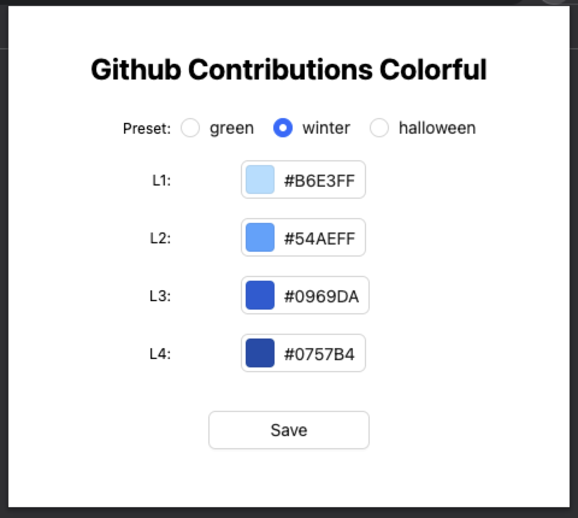

    

<h1 align="center">Github Contributions Colorful</h1>

## Overview

Github Contributions Colorful is a chrome extension for customizing the color of your graph, activity overview and contributions activity in your Github profile.

## How to use

[Click it to install this extension from chrome web store](https://chrome.google.com/webstore/detail/github-contributions-colo/fffjipkehlhimpfkhepackkddfpilcen). After installing, click its extension button to open a modal, the modal likes the following.

you can choose the preset or use L1 ~ L4 that is more flexible.
